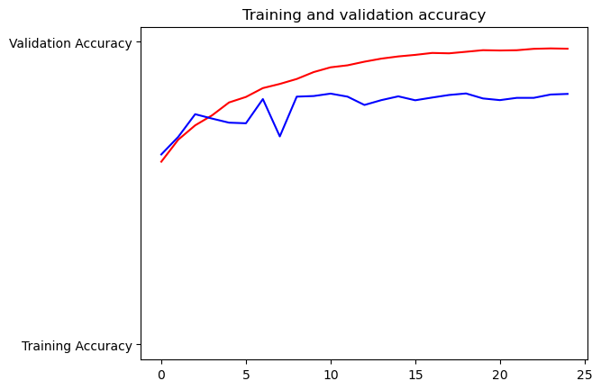
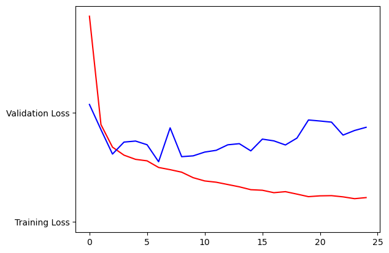
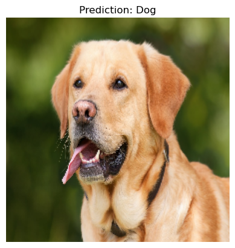
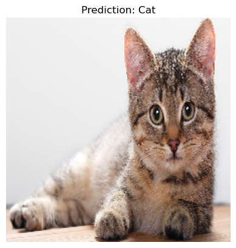

<h1 align="center">Unleashing the Power of CNNs: Classifying Cats and Dogs</h1>

## Description
<div style="text-align: justify">

This project focuses on building a Convolutional Neural Network (CNN) to classify images of cats and dogs. The model is trained on a dataset comprising 4,000 images of cats and 4,000 images of dogs, and tested on a separate set of 1,000 images each for cats and dogs to evaluate its performance.

After training and testing, the model can classify new images as either a cat or a dog by providing input images from the `single_prediction` folder. This project demonstrates the application of deep learning techniques for image classification tasks.

The CNN was implemented using TensorFlow and Keras libraries, leveraging their high-level APIs for ease of building and training neural networks. Key stages include data preprocessing, model building, training, evaluation, and prediction.

</div>

---

## Dataset
- **Training Data**: 4,000 cat images and 4,000 dog images
- **Test Data**: 1,000 cat images and 1,000 dog images
- **Prediction**: Images to classify stored in the `single_prediction` folder

---

## Model Architecture

The CNN model consists of the following layers:
- Convolutional layers with ReLU activation
- Max Pooling layers
- Batch Normalization layers
- Dropout layers for regularization
- Fully connected layers
- Sigmoid activation for binary classification

---

## Results

### Training Performance
<div style="display: flex;">
  <div style="margin: 10px; text-align: center;">
    
    <p>Training and Validation Accuracy</p>
  </div>
  <div style="margin: 10px; text-align: center;">
    
    <p>Training and Validation Loss</p>
  </div>
</div>

### Prediction Examples
<div style="display: flex;">
  <div style="margin: 10px;">
    
    <p>Prediction 1: Dog</p>
  </div>
  <div style="margin: 10px; ">
    
    <p>Prediction 2: Cat</p>
  </div>
</div>

---

## Requirements
To run this project, the following Python libraries are required:
- TensorFlow
- Keras (integrated with TensorFlow)
- NumPy
- Matplotlib
- Pandas
- OpenCV (cv2)

Ensure you have Python 3.7 or higher installed to maintain compatibility with the libraries.

---
## Usage

### 1. Clone the Repository
```bash
git clone https://github.com/Anaskaysar/Unleashing-the-Power-of-CNNs-Classifying-Cats-and-Dogs.git
cd Unleashing-the-Power-of-CNNs-Classifying-Cats-and-Dogs
Download The Dataset From Link Given in Dataset.txt file
```
### 2. Set Up the Environment
```
pip install tensorflow opencv-python numpy
```
### 3. Organize the Dataset
Structure the Dataset directory as follows:

```
dataset/
│
├── training_set/
│   ├── class1/
│   └── class2/
│
├── test_set/
│   ├── class1/
│   └── class2/
│
└── single_prediction/
    ├── image1.jpg
    └── image2.jpg
```
### 4. Run the Project
Execute the Jupyter Notebook file:

```bash
jupyter notebook CNN_for_Image_Classification.ipynb
```

## 🚀 Future improvements
- Enhance model performance with data augmentation and transfer learning.
- Optimize hyperparameters for better accuracy and generalization.
- Add additional classes for more complex image classification tasks.
- Use pretained models to compare with my CNN built CNN model.
- Use large dataset on the same model to see how it works with more data and variations